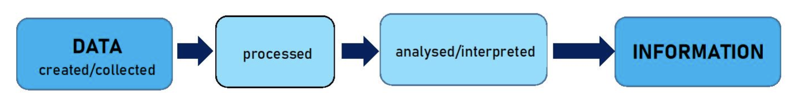

# Data and Information

### Terms

Data

A collection of text, numbers or symbols in a raw or unorganised form. Observation, experience, measurement and experiment are ways data can be created or collected. For example, the Bureau of Meterology (BoM) collects rainfall data each day, and has done for a very long time.

Information

Processed data that has been interpreted and organised to have meaning, providing context and relevance to the data. It helps in making decisions or understanding scenarios by providing insight and clarity. For example, BoM's rainfall data in isolation may not tell us much, but if we collate years worth of data into charts we can start to determine changes and trends

### Processing Data into Information

To process data into information, we start by collecting raw data from various sources. This data is then organised and cleaned to address any errors or inconsistencies.&#x20;

Once prepared, the data is subjected to analysis where specific patterns, relationships, or trends can be determined. This step involves using statistical methods or computational tools to interpret the data systematically.&#x20;

The insights derived from this analysis are then formatted into a comprehensible structure, such as graphs, reports, or summaries, providing context and value.&#x20;

This transformation from raw data to organised, meaningful information aids decision-making and enhances understanding of underlying phenomena.

<figure><figcaption></figcaption></figure>

### Why is this important?

This is important as **this is what computers were designed to do.** Computers are designed to take input data and process that data into some kind of output. The above is a more specific example of how we process and analyse data, but even something as simple as moving your mouse goes through this process.

### Input, Process, Output (IPO) Chart

IPO charts are used when planning a system to outline how each input will be processed into some kind of output, or how data will be processed into information.

The following is an example of an IPO chart for a computer mouse:

#### IPO Chart - Computer Mouse

| Input                       | Process                                   | Output                                                   |
| --------------------------- | ----------------------------------------- | -------------------------------------------------------- |
| Hand moves the mouse        | Computer moves the pointer on the screen  | Pointer changes position                                 |
| Finger presses mouse button | Computer checks what is under the pointer | Click action happens (e.g., button opens, file selected) |

For something more related to data and information, let's look at the rainfall data again. Imagine that the BoM is creating a system to access rainfall information and needs to allow users to check current and previous rainfall for their area.

#### IPO Chart - Rainfall Data

| Input                                               | Process                                           | Output                                                     |
| --------------------------------------------------- | ------------------------------------------------- | ---------------------------------------------------------- |
| Rainfall measurements collected by weather stations | Data is recorded, stored, and analysed by the BoM | Rainfall data shown on the BoM website, graphs, or reports |
| Location and date information                       | Organise rainfall by place and time               | Users can check rainfall for their area and date           |
| Previous rainfall records                           | Compare new data with old records                 | Trends, averages, and warnings (e.g. flood alerts)         |
